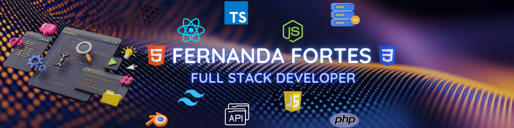

  

  <h1>Hi, I'm Fernanda Fortes! </h1>
  <h3>Full-stack developer specializing in intuitive and immersive web interfaces. I turn business requirements into high-performance solutions, optimizing the user experience and facilitating decision-making. I prioritize scalability and user-centered design in every line of code.</h3>
  <h4> (Mid-Level) | React.js • Angular.js • Javascript • MYSQL • APIs REST • Node.js • Typescript</h4>

###
<!--
<h3><b>FullStack Developer (Mid) |</b> React.js • Angular.js • Javascript • MYSQL • APIs REST • Node.js • Typescript</h3>

I'm a Full Stack Developer, Graphic Designer, and 3D Enthusiast with a strong passion for frameworks and libraries as Angular, React.js, Node.js, Three.js, REST APIs, and Data Management. I prioritize best practices in every project, focusing on requirements analysis, data validation, security, responsiveness, and immersive design.
 

<h3 align="left">🔥 My Stats :</h3>

###

  

    

-->
###

<h3 align="left">🛠 Language and tools</h3>

###
<!--

  

-->

###

  <table>
    <tr>
      <td align="center"><b>Frontend</b> </td>
      <td align="center"><b>Backend</b> </td>
    </tr>
    <tr>
      <td align="center"><b>Design/3D</b> </td>
      <td align="center"><b>DevOps and Tools</b> </td>
    </tr>
  </table>

### 👾 My GitHub Contribution Pacman
<picture>
  <source media="(prefers-color-scheme: dark)" srcset="https://raw.githubusercontent.com/NandaChaves/NandaChaves/output/pacman-contribution-graph.svg">
  <source media="(prefers-color-scheme: light)" srcset="https://raw.githubusercontent.com/NandaChaves/NandaChaves/output/pacman-contribution-graph.svg">
  
</picture>
---

### 🚀 Projetos em Destaque

- **[The Kainten Lab](https://kaitenlab2-0.infinityfreeapp.com/?i=1)** 🎩‧₊˚ ⋅ 🥢🍜‧₊˚ ⋅
  - 📝Description: Responsive management clone platform for restaurants, with CRUD functionalities to optimize the control of reservations, tables, and staff.
  - 🔍Problem: The original design created friction in the user journey, with external redirects (Google Maps) that caused users to leave the site and a lack of visual clarity in the menus.
  - 💡The Solution: I migrated the website to a high-performance architecture designed to deliver an immersive experience. I refined the booking process with dynamic hover states, native map integration, and clear workflow notifications.   ⚙️⚙️On the backend, I implemented a robust management system featuring automatic table assignment based on capacity, real-time occupancy dashboards, and responsive schedules for staff management.
   - 💻[Tecs]: PHP, MySQL, jQuery, JSON.
    
- **[ADVANCE - Lighting & Electrical Distributors ](https://advancelighting.pt/)** 💡🔦🔋🔌
  - 📝Description: A digital platform focused on the distribution and sale of professional LED lighting solutions and electrical materials.
  - 🔍Problem: The previous version(Wordpress) was static and lacked visually appeling fratures, making it difficult to quickly locate specific products in a technical catalog.
  - 💡The Solution: I migrated the site to a more high-performance architecture, focusing on an immersive visual experience. I developed an advanced filtering to speed up customer searches and restructured the content to make it more informative and persuasive.
  - 💻[Tecs]: React.js, MYSQL, PHP, Node.js, Figma, Canva.
    
- **[Iberolec](https://iberolec.com/)** 💡𖣤📱💃🏻
  - 📝Description: Official responsive platform for an LED product store in Madrid.
  - 🔍Problem: The need to build, from the ground up, a robust digital presence for the Madrid market would serve as a strategic arm of Advance Lighting, conveying professionalism and technical expertise.
  - 💡The Solution: Architecture and development of a comprehensive platform focused on user experience (UX) and conversion. The project delivers an intuitive system featuring multilingual support, centralized management of technicak catalogs, optimized contact forms and navigation organized by sector(Home Automation, Industrial Lighting, among others). 
  - 💻[Techs]: React.js, Email.js.

---

###
<!--
<table align="center" border="0" style="border: none;">
<tr>
<td width="40%">
  

- ⚛️ Full Stack Developer
- 🎨 Graphic Design
- 🧊 3d Modeleder

    

   

</td>

<td valign="top" width="50%" style="border: none;">

# 🚀 About Me

<b>FullStack Developer (Mid) |</b> React.js • Angular.js • Javascript • MYSQL • APIs REST • Node.js • Typescript</h3>

I'm a Full Stack Developer, Graphic Designer, and 3D Enthusiast with a strong passion for frameworks and libraries as Angular, React.js, Node.js, Three.js, REST APIs, and Data Management. I prioritize best practices in every project, focusing on requirements analysis, data validation, security, responsiveness, and immersive design.

## 🌎 Cᴏɴɴᴇᴄᴛ Wɪᴛʜ Mᴇ 

 

  
  

#

</td>
</tr>
</table>
-->

  

        
  

  

        <h3>🌎 Let's Connect and Grow Together!</h3>
        

            
            </a>
            
            
              
        

        
  <h3>✨ Fun Facts</h3>
        <ul>
            <li>I love Cinema, Music and Running</li>
            <li>I’m on a journey to build 3D Projects!</li>
            <li>I enjoy creating content for my YouTube channel, where I share coding tutorials, history and cinema.</li>
        </ul>
        
  <h3>💡⚛️🎨 My Work Approach </h3>
        

          As a full-stack developer with a strong focus on design and 3D, my work goes beyond just code. I use tools like Figma, Blender, and the Adobe suite to ensure that the interfaces I develop have a unique visual appeal, guaranteeing that the final product is both technically sound and aesthetically engaging.
        
 
        
  <h3>🧑‍💻 About Me</h3>
        

          I'm a Full Stack Developer, Graphic Designer, and 3D Enthusiast with a strong passion for frameworks and libraries as Angular, React.js, Node.js, Three.js, REST APIs, and Data Management.
          I prioritize best practices in every project, focusing on requirements    analysis, data validation, security, responsiveness, and immersive design
        

    

